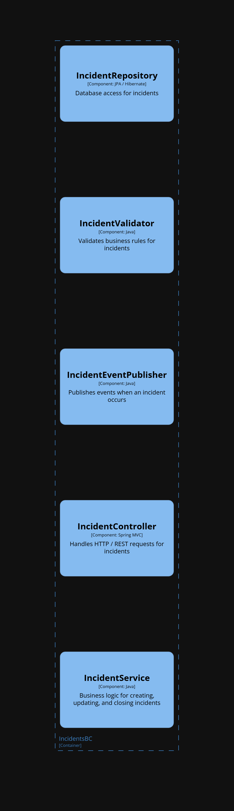
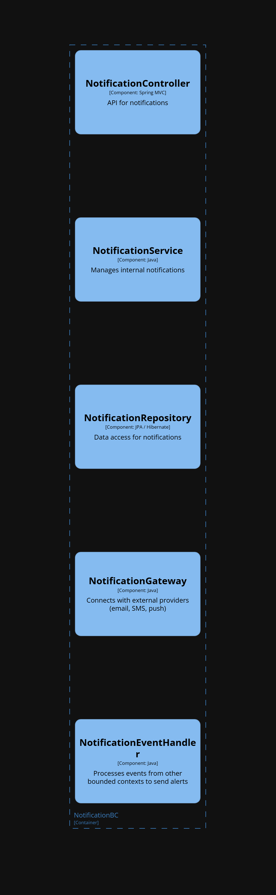
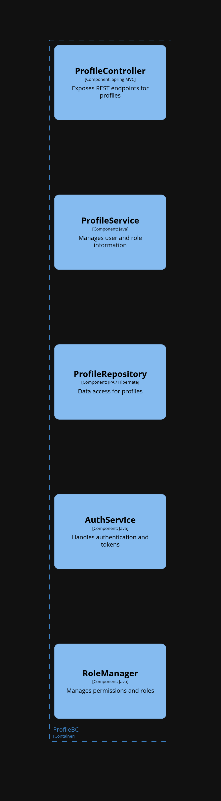

# COURSE PROJECT

    </img> 
    <strong>Universidad Peruana de Ciencias Aplicadas</strong> 
     
    <strong>Facultad de Ingeniería</strong> 
    <strong>Carrera de Ingeniería de Software</strong> 
    <strong>Ciclo 2025-2</strong>

  <strong>Código del curso: </strong>1ASI0729 
  <strong>Curso: </strong>Desarrollo de Aplicaciones Open Source

  <strong>NRC: 7349</strong>

    <strong>Profesor: </strong>Bautista Ubillús, Efraín Ricardo

    <strong>Informe de Trabajo Final</strong>

    <strong>Nombre del startup: </strong> NexoraPe

    <strong>Nombre del producto:</strong> SafeWork

    <h3 align="center">Integrantes del equipo:</h3>
    

     <table align="center">
        <tr>
            <th style="text-align:center;">Nombre</th>
            <th style="text-align:center;">Código</th>
        </tr>
        <tr>
            <td>Cacho Seminario, Diego Alonso</td>
            <td>u202223990</td>
        </tr>
        <tr>
            <td>Castro Sanchez, Amir Gabriel</td>
            <td>u202310680</td>
        </tr>
        <tr>
            <td>Tantaleán Mesta, Guillermo Fabián</td>
            <td>u202311958</td>
        </tr>
        <tr>
            <td>Vidal Castro, Miguel Angel</td>
            <td>u202314186</td>
        </tr>
    </table>

    <strong>Agosto, 2025</strong>

---

# Registro de Versiones del Informe

| **Versión** | **Fecha** | **Autor** | **Descripción de modificación** |
|     ---     |     ---   |     ---   |             ---                 |
| 1.0 | 26/08/2025 | Anónimo | Se implementó el diseño/esqueleto del informe sobre todas las secciones|
| 1.1 | 18/09/2025 | Anónimo | Se implementaron diversos puntos del trabajo|

---

# Project Report Collaboration Insights
**URL del repositorio para el Project Report:** [https://github.com/boafe/report](https://github.com/boafe/report)

Temporal => *En esta sección el equipo indica el URL del repositorio para el Project Report en la
organización de GitHub del equipo. Adicionalmente, para cada entrega explica cómo
se han desarrollado las actividades de elaboración del informe y se presenta
capturas en imagen de los analíticos de colaboración y commits en GitHub para el
repositorio del informe, realizados por los miembros del equipo. Todos los miembros
del equipo deben tener participación en la elaboración del informe. Esta sección
debe ir expandiéndose con descripciones y evidencias en cada entrega. Lo descrito y
evidenciado debe tener coherencia con el Registro de Versiones del Informe.*

---

# Contenido

- [Carátula](#course-project)
- [Registro de Versiones del Informe](#registro-de-versiones-del-informe)
- [Project Report Collaboration Insights](#project-report-collaboration-insights)
- [Contenido](#contenido)
- [Student Outcome](#student-outcome)

- [Capítulo I: Introducción](#capítulo-i-introducción)
  - [1.1. Startup Profile](#11-startup-profile)
    - [1.1.1. Descripción de la Startup](#111-descripción-de-la-startup)
    - [1.1.2. Perfiles de integrantes del equipo](#112-perfiles-de-integrantes-del-equipo)
  - [1.2. Solution Profile](#12-solution-profile)
    - [1.2.1. Antecedentes y problemática](#121-antecedentes-y-problemática)
    - [1.2.2. Lean UX Process](#122-lean-ux-process)
      - [1.2.2.1. Lean UX Problem Statements](#1221-lean-ux-problem-statements)
      - [1.2.2.2. Lean UX Assumptions](#1222-lean-ux-assumptions)
      - [1.2.2.3. Lean UX Hypothesis Statements](#1223-lean-ux-hypothesis-statements)
      - [1.2.2.4. Lean UX Canvas](#1224-lean-ux-canvas)
  - [1.3. Segmentos objetivo](#13-segmentos-objetivo)

- [Capítulo II: Requirements Elicitation & Analysis](#capítulo-ii-requirements-elicitation--analysis)
  - [2.1. Competidores](#21-competidores)
    - [2.1.1. Análisis competitivo](#211-análisis-competitivo)
    - [2.1.2. Estrategias y tácticas frente a competidores](#212-estrategias-y-tácticas-frente-a-competidores)
  - [2.2. Entrevistas](#22-entrevistas)
    - [2.2.1. Diseño de entrevistas](#221-diseño-de-entrevistas)
    - [2.2.2. Registro de entrevistas](#222-registro-de-entrevistas)
    - [2.2.3. Análisis de entrevistas](#223-análisis-de-entrevistas)
  - [2.3. Needfinding](#23-needfinding)
    - [2.3.1. User Personas](#231-user-personas)
    - [2.3.2. User Task Matrix](#232-user-task-matrix)
    - [2.3.3. User Journey Mapping](#233-user-journey-mapping)
    - [2.3.4. Empathy Mapping](#234-empathy-mapping)
  - [2.4. Big Picture Event Storming](#24-big-picture-event-storming)
  - [2.5. Ubiquitous Language](#25-ubiquitous-language)

- [Capítulo III: Requirements Specification](#capítulo-iii-requirements-specification)
  - [3.1. User Stories](#31-user-stories)
  - [3.2. Impact Mapping](#32-impact-mapping)
  - [3.3. Product Backlog](#33-product-backlog)

- [Capítulo IV: Product Design](#capítulo-iv-product-design)
  - [4.1. Style Guidelines](#41-style-guidelines)
    - [4.1.1. General Style Guidelines](#411-general-style-guidelines)
    - [4.1.2. Web Style Guidelines](#412-web-style-guidelines)
  - [4.2. Information Architecture](#42-information-architecture)
    - [4.2.1. Organization Systems](#421-organization-systems)
    - [4.2.2. Labeling Systems](#422-labeling-systems)
    - [4.2.3. SEO Tags and Meta Tags](#423-seo-tags-and-meta-tags)
    - [4.2.4. Searching Systems](#424-searching-systems)
    - [4.2.5. Navigation Systems](#425-navigation-systems)
  - [4.3. Landing Page UI Design](#43-landing-page-ui-design)
    - [4.3.1. Landing Page Wireframe](#431-landing-page-wireframe)
    - [4.3.2. Landing Page Mock-up](#432-landing-page-mock-up)
  - [4.4. Web Applications UX/UI Design](#44-web-applications-uxui-design)
    - [4.4.1. Web Applications Wireframes](#441-web-applications-wireframes)
    - [4.4.2. Web Applications Wireflow Diagrams](#442-web-applications-wireflow-diagrams)
    - [4.4.3. Web Applications Mock-ups](#443-web-applications-mock-ups)
    - [4.4.4. Web Applications User Flow Diagrams](#444-web-applications-user-flow-diagrams) 
  - [4.5. Web Applications Prototyping](#45-web-applications-prototyping)
  - [4.6. Domain-Driven Software Architecture](#46-domain-driven-software-architecture)
    - [4.6.1. Design-Level Event Storming](#461-design-level-event-storming)
    - [4.6.2. Software Architecture Context Diagram](#462-software-architecture-context-diagram)
    - [4.6.3. Software Architecture Container Diagrams](#463-software-architecture-container-diagrams)
    - [4.6.4. Software Architecture Components Diagrams](#464-software-architecture-components-diagrams)
  - [4.7. Software Object-Oriented Design](#47-software-object-oriented-design)
    - [4.7.1. Class Diagrams](#471-class-diagrams)
  - [4.8. Database Design](#48-database-design)
    - [4.8.1. Database Diagrams](#481-database-diagrams)

- [Capítulo V: Product Implementation, Validation & Deployment](#capítulo-v-product-implementation-validation--deployment)
  - [5.1. Software Configuration Management](#51-software-configuration-management)
    - [5.1.1. Software Development Environment Configuration](#511-software-development-environment-configuration)
    - [5.1.2. Source Code Management](#512-source-code-management)
    - [5.1.3. Source Code Style Guide & Conventions](#513-source-code-style-guide--conventions)
    - [5.1.4. Software Deployment Configuration](#514-software-deployment-configuration)
  - [5.2. Landing Page, Services & Applications Implementation](#52-landing-page-services--applications-implementation)
    - [5.2.X. Sprint n](#52x-sprint-n)
      - [5.2.X.1. Sprint Planning n](#52x1-sprint-planning-n)
      - [5.2.X.2. Aspect Leaders and Collaborators](#52x2-aspect-leaders-and-collaborators)
      - [5.2.X.3. Sprint Backlog n](#52x3-sprint-backlog-n)
      - [5.2.X.4. Development Evidence for Sprint Review](#52x4-development-evidence-for-sprint-review)
      - [5.2.X.5. Execution Evidence for Sprint Review](#52x5-execution-evidence-for-sprint-review)
      - [5.2.X.6. Services Documentation Evidence for Sprint Review](#52x6-services-documentation-evidence-for-sprint-review)
      - [5.2.X.7. Software Deployment Evidence for Sprint Review](#52x7-software-deployment-evidence-for-sprint-review)
      - [5.2.X.8. Team Collaboration Insights during Sprint](#52x8-team-collaboration-insights-during-sprint)
  - [5.3. Validation Interviews](#53-validation-interviews)
    - [5.3.1. Diseño de Entrevistas](#531-diseño-de-entrevistas)
    - [5.3.2. Registro de Entrevistas](#532-registro-de-entrevistas)
    - [5.3.3. Evaluaciones según heurísticas](#533-evaluaciones-según-heurísticas)
  - [5.4. Video About-the-Product](#54-video-about-the-product)

- [Conclusiones](#conclusiones)
  - [Conclusiones y recomendaciones](#conclusiones-y-recomendaciones)
  - [Video About-the-Team](#video-about-the-team)

- [Bibliografía](#bibliografía)

- [Anexos](#anexos)

---

# Student Outcome

El curso contribuye al cumplimiento del Student Outcome ABET: 
**ABET – EAC - Student Outcome 3**

**Criterio:** Capacidad de comunicarse efectivamente con un rango de audiencias.
En el siguiente cuadro se describe las acciones realizadas y enunciados de
conclusiones por parte del grupo, que permiten sustentar el haber alcanzado el logro
del ABET – EAC - Student Outcome 3.

| Criterio específico | Acciones realizadas | Conclusiones |
|---------------------|---------------------|--------------|
| **Comunica oralmente con efectividad a diferentes rangos de audiencia** | **Cacho Seminario, Diego Alonso** _**TB1**_  Realicé las correcciones necesarias dadas por mis compañeros respecto a los puntos con los que aporté para la TB1, además de subir correctamente mis aportes al repositorio en línea, respetando el formato requerido.
_**TP**_ [TP aqui blablablab] _**TB2**_ [Tb2 aqui ;V blablaba] _**TF**_ [TF aqui ;V blablabla]  **Castro Sanchez, Amir Gabriel** _**TB1**_ Morbi vel tortor id eros dictum venenatis id ut dui. Mauris quis tellus sed nunc hendrerit vehicula ac id mauris. Pellentesque volutpat tellus non ligula blandit ullamcorper quis sodales erat. _**TP**_ [TP aqui blablablab] _**TB2**_ [Tb2 aqui ;V blablaba] _**TF**_ [TF aqui ;V blablabla]  **Tantaleán Mesta, Guillermo Fabián** _**TB1**_ Morbi vel tortor id eros dictum venenatis id ut dui. Mauris quis tellus sed nunc hendrerit vehicula ac id mauris. Pellentesque volutpat tellus non ligula blandit ullamcorper quis sodales erat. _**TP**_ [TP aqui blablablab] _**TB2**_ [Tb2 aqui ;V blablaba] _**TF**_ [TF aqui ;V blablabla]  **Vidal Castro, Miguel Angel** _**TB1**_ Morbi vel tortor id eros dictum venenatis id ut dui. Mauris quis tellus sed nunc hendrerit vehicula ac id mauris. Pellentesque volutpat tellus non ligula blandit ullamcorper quis sodales erat. _**TP**_ [TP aqui blablablab] _**TB2**_ [Tb2 aqui ;V blablaba] _**TF**_ [TF aqui ;V blablabla]| Conclusion Aqui |
| **Comunica por escrito con efectividad a diferentes rangos de audiencia** |**Cacho Seminario, Diego Alonso** _**TB1**_  Realicé las correcciones necesarias dadas por mis compañeros respecto a los puntos con los que aporté para la TB1, además de subir correctamente mis aportes al repositorio en línea, respetando el formato requerido. _**TP**_ [TP aqui blablablab] _**TB2**_ [Tb2 aqui ;V blablaba] _**TF**_ [TF aqui ;V blablabla]  **Castro Sanchez, Amir Gabriel** _**TB1**_ Morbi vel tortor id eros dictum venenatis id ut dui. Mauris quis tellus sed nunc hendrerit vehicula ac id mauris. Pellentesque volutpat tellus non ligula blandit ullamcorper quis sodales erat. _**TP**_ [TP aqui blablablab] _**TB2**_ [Tb2 aqui ;V blablaba] _**TF**_ [TF aqui ;V blablabla]  **Tantaleán Mesta, Guillermo Fabián** _**TB1**_ Morbi vel tortor id eros dictum venenatis id ut dui. Mauris quis tellus sed nunc hendrerit vehicula ac id mauris. Pellentesque volutpat tellus non ligula blandit ullamcorper quis sodales erat. _**TP**_ [TP aqui blablablab] _**TB2**_ [Tb2 aqui ;V blablaba] _**TF**_ [TF aqui ;V blablabla]  **Vidal Castro, Miguel Angel** _**TB1**_ Morbi vel tortor id eros dictum venenatis id ut dui. Mauris quis tellus sed nunc hendrerit vehicula ac id mauris. Pellentesque volutpat tellus non ligula blandit ullamcorper quis sodales erat. _**TP**_ [TP aqui blablablab] _**TB2**_ [Tb2 aqui ;V blablaba] _**TF**_ [TF aqui ;V blablabla]| Conclusion Aqui |

---

# Capítulo I: Introducción

## 1.1. Startup Profile
### 1.1.1. Descripción de la Startup
[Contenido]
### 1.1.2. Perfiles de integrantes del equipo
| Foto | Nombre y Apellidos | Código de Estudiante | Carrera | Resumen de Conocimientos y Habilidades |
|------|--------------------|----------------------|---------|----------------------------------------|
|  | **Diego Alonso Cacho Seminario** | u202223990 | Ingeniería de Software | Habilidades: Soy estudiante de Ingeniería de Software cursando el 7mo ciclo de mi carrera en la UPC y tengo 20 años. Me considero una persona tranquila y diligente, intentó realizar mis tareas y trabajos lo antes posible para evitar contratiempos en un futuro, especialmente si son actividades que consumen mucho tiempo. Como miembro de equipo buscaré ayudar a mis compañeros cuando lo necesiten, realizando además mis entregas lo más temprano posible. Habilidades en C++, C#, Python, Unity 2D/3D, html/css/js. |
|  | **Amir Gabriel Castro Sanchez** | u202310680 | Ingeniería de Software | EJEMPLO DE IA (CAMBIARLO A TU GUSTO): Conocimientos en ciberseguridad, análisis de sistemas y modelado UML. Aporta al equipo su capacidad de análisis crítico y estructuración de soluciones escalables. |
|  | **Guillermo Fabián Tantaleán Mesta** | u202311958 | Ingeniería de Software | EJEMPLO DE IA (CAMBIARLO A TU GUSTO): Especialista en machine learning y ciencia de datos. Aporta experiencia en análisis estadístico, programación en Python y visualización de datos. |
|  | **Miguel Angel Vidal Castro** | u202314186 | Ingeniería de Software | EJEMPLO DE IA (CAMBIARLO A TU GUSTO): Conocimientos en gestión de proyectos y optimización de procesos. Aporta al equipo su enfoque en eficiencia, coordinación y manejo de recursos. |

## 1.2. Solution Profile
### 1.2.1 Antecedentes y problemática
##### **¿Cuál es el problema? (What)**

En muchas empresas del sector industrial, logístico y de construcción, los incidentes laborales (accidentes, riesgos o fallas de seguridad) no se reportan de manera inmediata o se pierden en trámites burocráticos. Este retraso impide que se tomen acciones correctivas rápidas y expone a los trabajadores a mayores riesgos. Según la Superintendencia Nacional de Fiscalización Laboral **(SUNAFIL, 2024\)**, en el Perú se registraron más de 2,800 inspecciones relacionadas a accidentes de trabajo entre el 2023 y 2024, siendo 381 de ellos mortales. 

##### **¿Cuándo ocurre el problema? (When)**

El problema ocurre en el día a día de las operaciones de fábricas, almacenes y obras de construcción, especialmente en actividades de alto riesgo (uso de maquinaria, manipulación de materiales, transporte interno). Los incidentes suelen suceder en horarios de alta carga laboral o en turnos nocturnos, cuando la supervisión es limitada y los procedimientos de reporte se vuelven más lentos o poco efectivos.

##### **¿Dónde ocurre el problema? (Where)**

Esta problemática se presenta en empresas medianas y grandes del sector industrial, logístico y de construcción en el Perú, donde la alta rotación de personal y la falta de digitalización dificultan el seguimiento de incidentes. También es frecuente en organizaciones donde la gestión de la seguridad depende de reportes en papel o sistemas fragmentados, lo que genera pérdida de información y baja trazabilidad.

##### **¿A quién afecta el problema? (Who)**

El problema impacta directamente a los trabajadores, quienes enfrentan riesgos de salud y seguridad sin un sistema eficiente para reportarlos. También afecta al personal de seguridad y salud ocupacional, que debe gestionar incidentes sin herramientas modernas de control, y a las empresas, que se ven expuestas a sanciones legales, pérdida de productividad y altos costos asociados a accidentes laborales.

##### **¿Por qué sucede el problema? (Why)**

La causa principal es la dependencia de procesos manuales (formularios físicos, llamadas telefónicas o correos informales) que retrasan la comunicación. Además, existe una cultura de poca prevención, donde los reportes de incidentes menores no siempre se registran, lo que impide detectar patrones de riesgo a tiempo. A esto se suma la falta de plataformas digitales especializadas en seguridad laboral que integren reporte, seguimiento y análisis en un mismo sistema.

##### **¿Cómo sucede el problema? (How)**

Cuando ocurre un incidente, el trabajador debe llenar formularios en papel o informar verbalmente a un supervisor. Esta información tarda en llegar al área de seguridad, se puede extraviar o se registra de manera incompleta. El seguimiento depende de llamadas o correos aislados, sin trazabilidad clara ni métricas de control. Como resultado, los incidentes se resuelven tarde o se repiten por falta de medidas preventivas oportunas.

##### **¿Cuán grande es el impacto de este problema? (How much)**

El impacto es significativo en términos humanos, legales y económicos. Según el Ministerio de Trabajo y Promoción del Empleo **(MTPE)**, en el año 2022 se registraron 16,458 accidentes laborales, siendo los sectores más afectados la construcción, manufactura y minería. A nivel social, la falta de sistemas efectivos de gestión de incidentes perpetúa entornos de trabajo inseguros y afecta la calidad de vida de miles de trabajadores y sus familias.

### 1.2.2 Lean UX Process.
#### 1.2.2.1. Lean UX Problem Statements.
En el sector industrial, logístico y de construcción en el Perú, los trabajadores y responsables de seguridad enfrentan grandes dificultades para gestionar de manera eficiente los incidentes laborales que ocurren en el día a día. La mayoría de reportes se realizan en papel, llamadas o mensajes informales, lo cual retrasa la atención y genera pérdida de información importante.

Hemos observado que no existen herramientas digitales simples y accesibles que permitan a los trabajadores reportar incidentes en tiempo real y a las empresas darles seguimiento estructurado hasta su resolución. Esta falta de digitalización limita la prevención de riesgos y perpetúa entornos de trabajo inseguros.

¿Cómo podemos ayudar a las empresas y trabajadores en el Perú a reportar y gestionar incidentes laborales de forma rápida, organizada y transparente, promoviendo la prevención de accidentes, reduciendo riesgos y garantizando la seguridad en sus entornos de trabajo?

#### 1.2.2.2. Lean UX Assumptions.
**¿Quién es el usuario?**

Trabajadores de fábricas, almacenes y obras de construcción en el Perú, así como personal de seguridad y salud ocupacional que necesitan gestionar incidentes laborales de manera organizada y en tiempo real.

**¿Dónde encaja nuestro producto en su vida?**

SafeWork se integra como una herramienta esencial en la rutina laboral, permitiendo a los trabajadores reportar riesgos o accidentes de forma inmediata desde su celular, y al personal de seguridad darles seguimiento estructurado, reduciendo papeleo y asegurando que los incidentes no pasen desapercibidos.

**¿Qué problemas tiene nuestro producto y cómo se pueden resolver?**

* Posible resistencia al uso de tecnología por parte de algunos trabajadores.  
  → Solución: interfaz intuitiva, capacitaciones breves y soporte en campo.  
* Temor a represalias por reportar incidentes.  
  → Solución: opción de reportes anónimos y protocolos de confidencialidad.  
* Baja frecuencia de uso en ambientes donde no siempre ocurren incidentes.  
  → Solución: agregar funciones de checklist preventivo y recordatorios de seguridad.

**¿Cómo y cuándo es usado nuestro producto?**

El producto se utiliza en el momento exacto en que ocurre un incidente o cuando un trabajador detecta un riesgo. Además, es empleado diariamente por el personal de seguridad para monitorear reportes, asignar responsables y cerrar incidentes. También se puede usar en reuniones de seguridad para revisar métricas e historial de casos.

**¿Qué características son importantes?**

* Reporte de incidentes en tiempo real con foto, ubicación y descripción.  
* Panel de control para responsables de seguridad.  
* Historial de incidentes y estadísticas exportables.  
* Sistema de asignación de responsables y seguimiento de casos.  
* Opción de reportes anónimos.  
* Dashboard de indicadores de seguridad.  
* Multiplataforma: acceso desde web.

**¿Cómo debe verse nuestro producto y cómo comportarse?**

Debe tener un diseño claro, simple y profesional, con íconos fáciles de reconocer y colores asociados a seguridad **(verde, amarillo, rojo)**. Su comportamiento debe ser rápido y confiable, con notificaciones inmediatas y flujos de interacción que requieran pocos pasos para registrar un reporte. Debe comportarse de manera que transmita confianza, facilidad y utilidad real en el entorno laboral.

#### 1.2.2.3. Lean UX Hypothesis Statements.
* **Creemos que** al permitir a los trabajadores reportar incidentes laborales de manera inmediata y digital desde la web, lograremos que los responsables de seguridad los atiendan más rápido y se reduzca el tiempo de respuesta ante riesgos. **Sabremos que** hemos tenido éxito cuando al menos el 60% de los incidentes sean registrados en la plataforma dentro de las primeras 24 horas de ocurridos.

* **Creemos que** al implementar un panel web de seguimiento con asignación de responsables y estado de incidentes, lograremos mayor control y trazabilidad en la gestión de la seguridad laboral. **Sabremos que** hemos tenido éxito cuando más del 70% de los reportes registrados tengan un responsable asignado y un estado actualizado dentro de los primeros 3 días.

* **Creemos que** ofrecer un historial accesible de incidentes con estadísticas y reportes ayudará a las empresas a tomar decisiones preventivas más efectivas. **Sabremos que** hemos tenido éxito cuando al menos el 80% de los usuarios responsables de seguridad accedan al módulo de reportes y estadísticas al menos una vez por semana.

#### 1.2.2.4. Lean UX Canvas.
[Contenido]

## 1.3. Segmentos objetivo.

- ##### **Personal encargado de la tramitación de accidentes e incidentes laborales**

Profesionales y responsables dentro de las áreas de seguridad ocupacional, recursos humanos o jefaturas inmediatas, que tienen como función reportar, registrar y dar seguimiento a accidentes o incidentes en el centro laboral.

**Características:**

* Buscan herramientas digitales que simplifiquen el proceso de reporte y documentación.  
* Necesitan reducir errores y duplicidad en la información al gestionar casos.  
* Valoran contar con un sistema centralizado que facilite la comunicación con las entidades competentes.

- ##### **Trabajadores afectados por accidentes o incidentes laborales**

Colaboradores que han sufrido un accidente o incidente en su centro de trabajo y requieren un seguimiento adecuado de su caso.

**Características:**

* Necesitan acceso rápido y claro a la información sobre el estado de su reporte.  
* Buscan confianza y transparencia en el proceso de registro y resolución de incidentes.  
* Valoran plataformas que les permitan sentirse acompañados y respaldados durante la gestión de su caso.

---

# Capítulo II: Requirements Elicitation & Analysis

## 2.1. Competidores.
Los competidores que hemos identificado para SafeWork son los siguientes:
CetAPP GO: Solución móvil especializada en la gestión de seguridad, salud y medio ambiente (HSE), con enfoque en grandes corporaciones. Destaca por su escalabilidad, rendimiento y operación sin instalación.
Laus: Plataforma integral para la gestión de Seguridad y Salud en el Trabajo (SST), orientada al cumplimiento normativo y automatización de procesos como capacitaciones, reportes de incidentes y control de equipos de protección.
Work Wallet: Aplicación todo-en-uno para la gestión digital de procesos de seguridad laboral, que incluye reportes de accidentes, auditorías, permisos de trabajo y control de personal, con enfoque en flexibilidad y personalización

### 2.1.1. Análisis competitivo.

| Competitive Analysis Landscape  |  |  |  |  |  |
| :---- | :---- | ----- | ----- | ----- | ----- |
| ¿Por qué llevar a cabo este análisis? |  | Con el objetivo de identificar las ventajas competitivas de SafeWork ante los competidores y definir las estrategias competitivas frente al mercado de seguridad en el trabajo. |  |  |  |
| Servicio |  | **SafeWork**  | **CetApp GO**  | **Laus**  | **Work Wallet**  |
|  Perfil | Overview | Plataforma web que centraliza el reporte, seguimiento y resolución de incidentes laborales, con un enfoque en simplicidad, accesibilidad y trazabilidad para empresas medianas y pequeñas. | Herramienta digital de gestión de Seguridad y Salud en el Trabajo (SST), utilizada para registrar, investigar y hacer seguimiento de incidentes laborales. | Software especializado en prevención de riesgos laborales y gestión de salud ocupacional, con módulos de formación, inspecciones y auditorías. | Plataforma internacional enfocada en comunicación de seguridad y gestión de incidentes en el lugar de trabajo. Incluye reportes en tiempo real, auditorías y checklists móviles. |
|  | Ventaja competitiva ¿Qué valor ofrece a los clientes?  | Valor para clientes: Permite a trabajadores y responsables registrar y dar seguimiento en tiempo real a los incidentes, con reportes claros y exportables. Accesible y económico frente a soluciones internacionales. | Valor para clientes: Cumplimiento con normativa nacional de SST, mayor formalización de los procesos y reducción del papeleo. | Valor para clientes: Ofrece una solución integral de prevención, combinando gestión de incidentes con capacitación y control de cumplimiento. | Valor para clientes: Accesibilidad móvil y comunicación inmediata, lo que agiliza la reacción en incidentes y refuerza la cultura de seguridad. |
| Perfil de Marketing | Mercado Objetivo | Empresas medianas o pequeñas, especialmente de manufactura, logística y construcción que requieren cumplir con normativas de seguridad sin grandes costos. | Empresas nacionales que deben cumplir con la Ley de Seguridad y Salud en el Trabajo en Perú y Latinoamérica. | Corporaciones y empresas con alta exposición a riesgos laborales, interesadas en centralizar prevención, formación y control. | Empresas globales que buscan mejorar la comunicación interna en seguridad y reducir incidentes mediante apps móviles. |
|  | Estrategias de marketing | Alianzas con gremios empresariales, campañas educativas en LinkedIn y webinars sobre SST accesible. | Posicionamiento a través de consultoras en SST y capacitaciones empresariales. | Marketing institucional, presencia en ferias de seguridad laboral, venta directa a grandes clientes. | Campañas digitales en mercados internacionales, uso de casos de éxito en grandes organizaciones. |
|  Perfil de productos | Productos & Servicios | Registro digital de incidentes y accidentes laborales. Panel de seguimiento para responsables de seguridad. Historial de casos por trabajador y por área. Sistema de asignación de responsables y seguimiento de casos. Opción de reportes anónimos. Dashboard de indicadores de seguridad. | Registro y notificación de accidentes e incidentes en cumplimiento con normativas locales. Módulos de investigación y análisis de causas. Gestión documental para SST (informes, actas, auditorías). Generación de indicadores y estadísticas de seguridad. Integración con capacitaciones en seguridad. | Gestión integral de prevención de riesgos laborales. Módulo de inspecciones y auditorías internas. Capacitación online para trabajadores. Registro de incidentes y enfermedades ocupacionales. Herramientas de cumplimiento normativo internacional. | Reporte de incidentes en tiempo real desde dispositivos móviles. Auditorías y checklists digitales. Comunicación instantánea entre trabajadores y responsables vía app. Módulo de inducción digital para trabajadores nuevos. Herramientas de análisis de tendencias en seguridad. |
|  | Precios & Costos  | Modelo SaaS accesible, con planes escalonados según número de usuarios y nivel de funcionalidad. | Suscripción por licencia anual, con precios adaptados al tamaño de la empresa. | Modelo de licencias empresariales con costo elevado, diseñado para corporaciones. | Planes por suscripción mensual, con precios diferenciados según cantidad de usuarios activos. |
|  | Canales de distribución (Web y/o Móvil) | Plataforma web responsive accesible desde cualquier navegador. | Plataforma web y aplicación móvil. | Plataforma web con módulos móviles. | Web y aplicación móvil (iOS y Android). |
|  Análisis SWOT | Fortalezas | Simplicidad y accesibilidad para PYMEs, costos bajos, enfoque local. Base de usuarios inicial limitada, falta de reputación consolidada. Creciente necesidad de digitalizar reportes en PYMEs. Competidores internacionales más robustos, cambios regulatorios. | Adaptación al marco normativo peruano y latinoamericano, experiencia en SST. Interfaz más técnica, menos intuitiva para el trabajador promedio. Demanda de cumplimiento legal en empresas medianas. Aparición de soluciones más fáciles de usar. | Solución integral que combina formación, prevención e incidentes. Alto costo, accesible solo para empresas grandes. Expansión en corporaciones multinacionales. Pérdida de atractivo frente a opciones más económicas. | Fuerte enfoque móvil y comunicación instantánea. Dependencia de conectividad móvil, curva de aprendizaje para usuarios. Crecimiento del trabajo remoto y digitalización de SST. Competencia de apps locales adaptadas al marco legal de cada país. |
|  | Debilidades | Simplicidad y accesibilidad para PYMEs, costos bajos, enfoque local. Base de usuarios inicial limitada, falta de reputación consolidada. Creciente necesidad de digitalizar reportes en PYMEs. Competidores internacionales más robustos, cambios regulatorios. | Adaptación al marco normativo peruano y latinoamericano, experiencia en SST. Interfaz más técnica, menos intuitiva para el trabajador promedio. Demanda de cumplimiento legal en empresas medianas. Aparición de soluciones más fáciles de usar. | Solución integral que combina formación, prevención e incidentes. Alto costo, accesible solo para empresas grandes. Expansión en corporaciones multinacionales. Pérdida de atractivo frente a opciones más económicas. | Fuerte enfoque móvil y comunicación instantánea. Dependencia de conectividad móvil, curva de aprendizaje para usuarios. Crecimiento del trabajo remoto y digitalización de SST. Competencia de apps locales adaptadas al marco legal de cada país. |
|  | Oportunidades | Simplicidad y accesibilidad para PYMEs, costos bajos, enfoque local. Base de usuarios inicial limitada, falta de reputación consolidada. Creciente necesidad de digitalizar reportes en PYMEs. Competidores internacionales más robustos, cambios regulatorios. | Adaptación al marco normativo peruano y latinoamericano, experiencia en SST. Interfaz más técnica, menos intuitiva para el trabajador promedio. Demanda de cumplimiento legal en empresas medianas. Aparición de soluciones más fáciles de usar. | Solución integral que combina formación, prevención e incidentes. Alto costo, accesible solo para empresas grandes. Expansión en corporaciones multinacionales. Pérdida de atractivo frente a opciones más económicas. | Fuerte enfoque móvil y comunicación instantánea. Dependencia de conectividad móvil, curva de aprendizaje para usuarios. Crecimiento del trabajo remoto y digitalización de SST. Competencia de apps locales adaptadas al marco legal de cada país. |
|  | Amenazas | Simplicidad y accesibilidad para PYMEs, costos bajos, enfoque local. Base de usuarios inicial limitada, falta de reputación consolidada. Creciente necesidad de digitalizar reportes en PYMEs. Competidores internacionales más robustos, cambios regulatorios. | Adaptación al marco normativo peruano y latinoamericano, experiencia en SST. Interfaz más técnica, menos intuitiva para el trabajador promedio. Demanda de cumplimiento legal en empresas medianas. Aparición de soluciones más fáciles de usar. | Solución integral que combina formación, prevención e incidentes. Alto costo, accesible solo para empresas grandes. Expansión en corporaciones multinacionales. Pérdida de atractivo frente a opciones más económicas. | Fuerte enfoque móvil y comunicación instantánea. Dependencia de conectividad móvil, curva de aprendizaje para usuarios. Crecimiento del trabajo remoto y digitalización de SST. Competencia de apps locales adaptadas al marco legal de cada país. |

### 2.1.2. Estrategias y tácticas frente a competidores.
**SafeWork** aplicará una estrategia de diferenciación enfocada en la simplicidad de uso y en la adaptación al contexto local de seguridad laboral, destacando por su sistema de reportes inmediatos, trazabilidad clara de casos y generación automática de informes. Frente a competidores como CetApp GO, Laus y Work Wallet, SafeWork se posiciona como una solución ágil, accesible y diseñada para pequeñas y medianas empresas, donde el cumplimiento normativo y la prevención de riesgos son críticos, pero los recursos suelen ser limitados.

El valor de SafeWork está en ofrecer una plataforma ligera y directa, con un flujo de reporte optimizado, lo que reduce los tiempos de respuesta y minimiza la subnotificación de incidentes. Además, integra un chat interno para comunicación rápida, lo cual no está plenamente desarrollado en soluciones competidoras.

Aprovechará las debilidades de otros sistemas como su alta complejidad, precios elevados o la poca adaptación a la realidad de las PYMEs locales. Para mitigar amenazas como la resistencia al cambio tecnológico o la competencia de grandes soluciones internacionales, SafeWork implementará capacitaciones digitales simples, un modelo de precios accesible y un acompañamiento continuo al cliente, reforzando la confianza y el uso sostenido de la herramienta.

## 2.2. Entrevistas.
### 2.2.1. Diseño de entrevistas.

**Segmento objetivo 1: Personal encargado de la tramitación de accidentes e incidentes laborales**

* ¿Cuál es tu nombre completo?

* ¿Cuántos años tienes?

* ¿En dónde vives?

* ¿Cuál es tu cargo dentro de la empresa?

* ¿Cada cuánto tiempo recibes reportes de incidentes laborales?

* ¿Qué medios utilizan actualmente para registrar y dar seguimiento a los incidentes?

* ¿Qué problemas encuentras en el proceso actual de reporte y documentación de incidentes?

* ¿Has tenido casos en los que los reportes se pierden o llegan tarde? ¿Qué consecuencias generó?

* ¿Qué características crees que debería tener una herramienta digital para ayudarte a gestionar incidentes de manera más eficiente?

* ¿Te resultaría útil que la plataforma genere reportes automáticos y consolidados para auditorías o inspecciones?

* ¿Qué tan importante es para ti poder asignar responsables y dar seguimiento en tiempo real a la resolución de un incidente?

**Segmento objetivo 2: Trabajadores afectados por accidentes o incidentes laborales**

* ¿Cuál es tu nombre completo?

* ¿Cuántos años tienes?

* ¿En dónde vives?

* ¿En qué área o puesto trabajas actualmente?

* ¿Has tenido algún accidente o incidente laboral en tu centro de trabajo? ¿Cómo lo reportaste?

* ¿Qué tan fácil o difícil fue reportarlo en ese momento?

* ¿Alguna vez sentiste que tu reporte no fue atendido o quedó sin seguimiento?

* ¿Qué tanto confías en el proceso actual que tiene tu empresa para registrar y resolver incidentes laborales?

* ¿Qué tan importante sería para ti contar con una plataforma donde pudieras reportar un incidente de forma rápida y saber el estado de tu caso en tiempo real?

* ¿Qué información te gustaría poder registrar en un reporte digital (fotos, ubicación, descripción, testigos, etc.)?

* ¿Crees que una plataforma así te daría más confianza de que tu seguridad y bienestar están siendo tomados en serio?

* ¿Qué temores o preocupaciones tendrías al usar una herramienta digital para reportar incidentes?

### 2.2.2. Registro de entrevistas.

**Segmento objetivo \#1: Personal encargado de la tramitación de accidentes e incidentes laborales** 

Entrevistado N°1: Miguel Angel Saucedo Zambrano

* Sexo: Masculino  
* Edad: 34 años  
* Ubicación en la que vive: Santiago de Chile

Acerca de la entrevista:

* Instante en el que inicia:  
* Duración: 3:24

Resumen:

….

Entrevistado N°2:

* Sexo:  
* Edad:  
* Ubicación en la que vive:

Acerca de la entrevista:

* Instante en el que inicia:  
* Duración:

Resumen:

….

Entrevistado N°3:

* Sexo:   
* Edad:  
* Ubicación en la que vive:

Acerca de la entrevista:

* Instante en el que inicia:  
* Duración:

….

**Segmento objetivo \#2: Trabajadores afectados por accidentes o incidentes laborales**

Entrevistada N°1: Mario André Cacho Seminario

* Sexo: Masculino  
* Edad: 22  
* Ubicación en la que vive: Lima, Surco

Acerca de la entrevista:

* Instante en el que inicia:   
* Duración: 3:20

Resumen:  
Para Mario, cuando pasó por este pequeño accidente durante sus horas de trabajo, lo más complicado para él fue realizar el reporte ya que el sistema presentaba fallas y se demoraba en responder, por ello se le fue difícil subir la información para su reporte. Considera además que una plataforma como SafeWork podría ser muy útil cuando no puedes depender de solo el servicio que tiene tu empresa ya que en ocasiones pueden ocurrir problemas como le ocurrió a él.

Entrevistado N°2: Sebastián De Las Casas Latour

* Sexo: Masculino  
* Edad: 21  
* Ubicación en la que vive: Lima, Surco

Acerca de la entrevista:

* Instante en el que inicia:   
* Duración: 5:26

Resumen:

Para Sebastián una plataforma que le permita organizar y mantener un seguimiento de los incidentes o accidentes podría ser de gran ayuda en caso pase por un problema similar en un futuro. Si bien considera que no tuvo problemas al reportar los incidentes ya que la empresa lo manejo de una manera correcta, indica que si hubiera tenido una herramienta similar a SafeWork, el proceso hubiera sido más rápido, no se habría encontrado confundido de qué hacer cuando sufrió el accidente y podría tener un registro de lo que ocurre en caso se tenga que realizar algún seguimiento.

### 2.2.3. Análisis de entrevistas.
De acuerdo con la información recopilada de las entrevistas, realizamos el siguiente análisis de entrevistas:

* **Segmento objetivo \#1:**

**Hallazgos:**

* **Segmento objetivo \#2:** 

**Hallazgos:**  
**Problemas técnicos**: los sistemas actuales pueden fallar o ser poco confiables (caso Mario).  
**Falta de claridad**: los trabajadores no siempre saben qué hacer en el momento del accidente (caso Sebastián).  
**Valor percibido de SafeWork**: ambos coinciden en que una plataforma externa facilitaría el proceso, ya sea por ser más confiable o por ofrecer seguimiento claro.  
**Necesidad de accesibilidad**: los trabajadores quieren poder reportar y dar seguimiento de manera rápida, sencilla y sin depender exclusivamente del área de la empresa.

* Conclusiones de ambos segmentos:

Para el segmento 1, …..

Por otro lado, para el segmento 2, las entrevistas muestran que, aunque la gestión interna de accidentes puede funcionar en algunos casos, existen fallas técnicas y vacíos en la experiencia del trabajador que generan frustración o confusión. Una herramienta como SafeWork representa una oportunidad clara para mejorar la confiabilidad del proceso de reporte frente a fallas en los sistemas empresariales, guiar al trabajador en los pasos a seguir inmediatamente después del accidente y por último brindar trazabilidad y registro histórico, aumentando la seguridad y confianza de los trabajadores en la gestión de sus incidentes.

## 2.3. Needfinding.
Se presentan en esta sección los resultados del análisis de la información recolectada de los segmentos objetivos.

**Segmento objetivo \#1: Personal encargado de la tramitación de accidentes e incidentes laborales** 

* Motivaciones Principales:  
- ….

* Problemas Identificados:  
- ….

* Requerimientos para una plataforma ideal:  
- ….

**Segmento objetivo \#2: Trabajadores afectados por accidentes o incidentes laborales**

* Motivaciones Principales:  
- Reportar rápidamente un accidente/incidente para recibir ayuda inmediata.

- Garantizar que su caso sea atendido y no quede olvidado en trámites internos.

- Tener claridad y orientación sobre qué hacer en el momento del accidente.

- Mantener un registro personal de los accidentes/incidentes sufridos.

- Confiar en que su información será tratada de forma segura y transparente.

* Problemas Identificados:  
- Sistemas internos de la empresa que presentan fallas técnicas o lentitud al momento de reportar (ejemplo Mario).

- Falta de claridad sobre los pasos a seguir después de un accidente (ejemplo Sebastián).

- Procesos burocráticos que generan demora en la atención.

- Ausencia de un registro personal accesible de los casos.

- Dependencia total de las áreas internas de la empresa, lo que genera vulnerabilidad cuando fallan sus sistemas.

* Requerimientos para una plataforma ideal:  
- Interfaz simple y rápida que permita registrar un reporte en pocos pasos.

- Guía paso a paso para que el trabajador sepa qué hacer en cada situación.

- Confiabilidad técnica (sin fallas, carga ligera, accesible desde web y móvil).

- Funcionalidad de seguimiento en tiempo real para ver el estado del caso.

- Historial de reportes accesible en el perfil del usuario.

- Seguridad de datos que brinde confianza en el manejo de la información sensible.

### 2.3.1. User Personas.
**User Persona del Personal encargado de la tramitación de accidentes e incidentes laborales:** 

**User Persona del Trabajador afectado por accidentes o incidentes laborales:**  

### 2.3.2. User Task Matrix.
En esta se presenta el user task matrix, herramienta centrada en los segmentos objetivos que nos permitirá identificar las tareas y objetivos claves de los usuarios.

| USER TASK  | Carla Méndez |  | José Ramírez |  |
| ----- | :---: | :---: | :---: | :---: |
|  | **Frequency** | **Importance** | **Frequency** | **Importance** |
| Registrar un accidente o incidente | Always | High | Sometimes | High |
| Revisar reportes de trabajadores | Often | High | Rarely | Medium |
| Revisar reportes de trabajadores | Always | High | Often | High |
| Generar informes para auditorías o gerencia | Often | High | Never | Low |
| Acceder al historial de incidentes pasados | Often | Medium | Sometimes | Medium |
| Recibir notificaciones sobre actualizaciones de casos | Always | High | Always | High |
| Subir evidencia (fotos, documentos, videos) | Sometimes | High | Often | High |
| Consultar medidas correctivas aplicadas | Often | High | Sometimes | High |
| Comunicarme con responsables (supervisor, médico laboral, etc.) | Often | High | Sometimes | High |
| Reportar condiciones inseguras (antes que un accidente ocurra) | Sometimes | High | Often | High |

### 2.3.3. User Journey Mapping.
Ambos Journey Maps pueden ser visualizados desde este enlace: [https://www.figma.com/design/OA8KMXSmn9KhEPqj9qRM0w/Journey-Map---Open-Source-2025-2?node-id=1-1315\&t=8xYjnKyJQwllgqro-1](https://www.figma.com/design/OA8KMXSmn9KhEPqj9qRM0w/Journey-Map---Open-Source-2025-2?node-id=1-1315&t=8xYjnKyJQwllgqro-1) 

User Journey Mapping Personal encargado de la tramitación de accidentes e incidentes laborales:  

User Journey Mapping Trabajador afectado por accidentes o incidentes laborales:  

### 2.3.4. Empathy Mapping.
Empathy mapping de Personal encargado de la tramitación de accidentes e incidentes laborales  

Empathy mapping de Trabajador afectado por accidentes o incidentes laborales

### 2.3.5. As-Is Scenario Mapping.
Se realizaron los siguientes cuadros en la herramienta Canva Whiteboard, el link original puede ser observado aquí: [https://www.canva.com/design/DAGzW03jLMs/g\_OiVuR-JggoMUGJMwWTuA/edit?utm\_content=DAGzW03jLMs\&utm\_campaign=designshare\&utm\_medium=link2\&utm\_source=sharebutton](https://www.canva.com/design/DAGzW03jLMs/g_OiVuR-JggoMUGJMwWTuA/edit?utm_content=DAGzW03jLMs&utm_campaign=designshare&utm_medium=link2&utm_source=sharebutton) 

* **As-Is Scenario Mapping para Personal encargado de la tramitación de accidentes e incidentes laborales**

* **As-Is Scenario Mapping para Trabajador afectado por accidentes o incidentes laborales**

### 2.3.6 To-Be Scenario Mapping.
Se realizaron los siguientes cuadros en la herramienta Canva Whiteboard, el link original puede ser observado aquí: [https://www.canva.com/design/DAGzW-JsLAw/mDMx7Dd5OpulQwCwOf8RXA/edit?utm\_content=DAGzW-JsLAw\&utm\_campaign=designshare\&utm\_medium=link2\&utm\_source=sharebutton](https://www.canva.com/design/DAGzW-JsLAw/mDMx7Dd5OpulQwCwOf8RXA/edit?utm_content=DAGzW-JsLAw&utm_campaign=designshare&utm_medium=link2&utm_source=sharebutton) 

* **To-Be Scenario Mapping para Personal encargado de la tramitación de accidentes e incidentes laborales**

* **To-Be Scenario Mapping para Trabajador afectado por accidentes o incidentes laborales**

## 2.4. Big Picture Event Storming.
[Contenido]

## 2.5. Ubiquitous Language.
[Contenido]

---

# Capítulo III: Requirements Specification
## 3.1. User Stories.

* EPICS

Las Epic definidas para SafeWork están orientadas a cubrir las necesidades principales tanto del personal encargado de la tramitación de accidentes e incidentes laborales como la de los trabajadores afectados por accidentes o incidentes laborales. Estas epics abordan funcionalidades esenciales para el funcionamiento de la plataforma, asegurando una experiencia fluida y efectiva por parte de ambos segmentos.

| Epic / Story ID | Título | Descripción |
| :---: | ----- | ----- |
| EP01 | Navegación en Landing Page | Como visitante de SafeWork, deseo poder navegar fácilmente en la landing page para entender el propósito de la plataforma, sus beneficios y cómo me puede ayudar en la gestión o reporte de incidentes laborales. |
| EP02 | Autenticación y Registro de Usuarios | Como usuario nuevo, deseo registrarme e iniciar sesión con mis credenciales de forma segura para poder acceder a las funcionalidades que me corresponden (trabajador o personal SST). |
| EP03 | Recuperación de Contraseña | Como usuario registrado, deseo recuperar mi contraseña de forma sencilla en caso de olvidarla para mantener el acceso a mi cuenta. |
| EP04 | Reporte de Accidentes e Incidentes | Como trabajador, deseo registrar rápidamente un accidente o incidente desde mi móvil o web para notificar de inmediato al área encargada y que se actúe oportunamente. |
| EP05 | Gestión de Reportes | Como personal SST, deseo recibir, revisar y actualizar los reportes enviados por trabajadores para dar seguimiento y aplicar medidas correctivas. |
| EP06 | Seguimiento y Estado de Casos | Como trabajador, deseo ver el estado y avance de mi reporte (en revisión, en acción correctiva, cerrado) para saber en qué etapa se encuentra mi caso. |
| EP07 | Soporte y Preguntas Frecuentes | Como usuario, deseo acceder a una sección de soporte y FAQ para resolver dudas comunes sin necesidad de contactar a un asesor. |
| EP08 | Perfil de Usuario y Roles | Como usuario, deseo configurar mi perfil y rol (trabajador o personal SST) para que la plataforma muestre opciones personalizadas a mis necesidades. |
| EP09 | Sistema de Notificaciones | Como usuario, deseo recibir notificaciones en tiempo real (web y móvil) cuando se actualice un reporte o se asigne una acción, para estar siempre informado. |
| EP10 | Gestión Documental | Como personal SST, deseo adjuntar documentos (fotos, reportes médicos, normativas) a un caso para llevar un registro más completo y organizado. |
| EP11 | Comunicación Interna | Como trabajador y como personal SST, deseo contar con un chat interno asociado a cada reporte para coordinar y dar seguimiento directo dentro de la plataforma. |
| EP12 | Estadísticas y Reportes Analíticos | Como personal SST, deseo visualizar gráficos y métricas sobre los incidentes reportados para detectar patrones y tomar decisiones preventivas. |
| EP13 | Validación y Seguridad de Datos | Como administrador de la plataforma, deseo que la información registrada esté protegida y validada para garantizar la confidencialidad, integridad y trazabilidad de los reportes. |

* User Stories

| Epic / Story ID | Título | Descripción | Criterios de Aceptación | Relacionado con (Epic ID) |
| :---: | ----- | ----- | ----- | :---: |
| US01 | Navegación Intuitiva en la Landing Page | Como visitante de SafeWork, deseo que la landing page tenga una barra de navegación clara y accesible para encontrar fácilmente las secciones importantes. | **Escenario 01:** Given que estoy en la landing page, When hago clic en el menú, Then debería ver opciones como “Inicio”, “Reportar Incidente”, “Sobre Nosotros” y “Contacto”. **Escenario 02:** Given que paso el cursor sobre un ítem, When el ítem está activo, Then debería resaltarse. | EP01 |
| US02 | Visualización de Beneficios | Como visitante, deseo visualizar claramente los beneficios de usar SafeWork para entender su propuesta de valor. | **Escenario 1:** Given que ingreso a la landing page, When hago scroll, Then debería ver una sección con íconos y descripciones sobre rapidez, seguridad y transparencia. | EP01 |
| US03 | Acceso a Testimonios | Como visitante, deseo leer testimonios de otros usuarios para generar confianza en la plataforma. | **Escenario 1:** Given que ingreso a la landing page, When accedo a la sección de testimonios, Then debería ver opiniones de trabajadores y personal de SST. | EP01 |
| US04 | Registro de Usuario | Como usuario nuevo, deseo registrarme con correo y usuario para crear una cuenta en SafeWork. | **Escenario 1:** Given que ingreso a la sección de registro, When lleno mis datos y acepto los términos, Then debería crearse mi cuenta. | EP02 |
| US05 | Inicio de Sesión Seguro | Como usuario, deseo iniciar sesión con mis credenciales para acceder a mis funcionalidades. | **Escenario 1:** Given que ya tengo cuenta, When ingreso mis credenciales válidas, Then debería poder acceder a mi perfil. | EP02 |
| US06 | Roles Diferenciados | Como usuario, deseo seleccionar mi rol (trabajador o personal SST) para personalizar la experiencia. | **Escenario 1:** Given que estoy en el registro, When selecciono un rol, Then la plataforma debería mostrar opciones según el tipo de usuario. | EP02 |
| US07 | Recuperación de Contraseña | Como usuario, deseo recuperar mi contraseña mediante botón para poder acceder si la olvido. | **Escenario 1:** Given que me encuentro en la página de iniciar sesión y olvidé mi contraseña, When ingreso a la aplicación, Then debería poder presionar un botón de recuperación. **Escenario 02:** Given que presione el botón, When hago clic, Then debería poder establecer una nueva contraseña. | EP03 |
| US08 | Revisión de contraseña al registrarse | Como usuario nuevo, deseo que el sistema me pida utilizar ciertos caracteres para asegurar mi contraseña. | **Escenario 01:** Given que escribo una contraseña, When la contraseña no presenta caracteres seguros, Then debería aparecer un mensaje de error. **Escenario 02:** Given que la contraseña presenta caracteres seguros, When confirmo el registro, Then debería crearse la cuenta sin problemas. | EP02 |
| US09 | Reportar Accidente | Como trabajador, deseo registrar un accidente laboral con fotos y detalles para notificar de inmediato a la empresa. | **Escenario 1:** Given que sufrí un accidente, When ingreso a la opción “Reportar”, Then debería poder completar un formulario con descripción, ubicación y archivos adjuntos. | EP04 |
| US10 | Reportar Incidente | Como trabajador, deseo reportar un incidente menor para que quede registrado y pueda prevenir futuros accidentes. | **Escenario 1:** Given que soy trabajador, When selecciono “Incidente” en el formulario, Then debería poder describir la situación sin necesidad de adjuntar documentos obligatorios. | EP04 |
| US11 | Geolocalización del Reporte | Como trabajador, deseo que mi reporte incluya ubicación geográfica para mayor precisión en la atención. | **Escenario 1:** Given que estoy registrando un reporte, When habilito la ubicación, Then el sistema debería guardar las coordenadas en el reporte. | EP04 |
| US12 | Revisión de Reportes | Como personal SST, deseo revisar todos los reportes enviados para priorizar los más urgentes. | **Escenario 1:** Given que accedo al panel, When seleccionó un reporte, Then debería ver su nivel de urgencia. | EP05 |
| US13 | Asignación de Responsables | Como personal SST, deseo asignar responsables a cada caso para garantizar el seguimiento. | **Escenario 1:** Given que reviso un reporte, When selecciono “Asignar responsable”, Then debería enviar una notificación al designado. | EP05 |
| US14 | Actualización de Estado | Como personal SST, deseo cambiar el estado de un reporte (pendiente, en proceso, cerrado) para llevar control de avances. | **Escenario 1:** Given que un reporte está en revisión, When actualizo el estado, Then se debería de poder ver el cambio al refrescar. | EP05 |
| US15 | Visualizar Estado del Reporte | Como trabajador, deseo ver en qué estado está mi reporte para mantenerme informado. | **Escenario 1:** Given que envié un reporte, When ingreso a “Mis reportes”, Then debería ver el estado actualizado. | EP05 |
| US16 | Historial de Reportes | Como trabajador, deseo consultar mis reportes anteriores para tener un registro personal. | **Escenario 1:** Given que accedo a mi perfil, When selecciono “Historial”, Then debería ver la lista de reportes enviados con sus estados finales. | EP06 |
| US17 | Preguntas Frecuentes | Como visitante, deseo consultar una sección de FAQ para resolver dudas comunes. | **Escenario 1:** Given que estoy en el menú, When selecciono “Ayuda”, Then debería ver una lista de preguntas frecuentes organizadas por categoría. | EP07 |
| US18 | Chat de Soporte | Como usuario, deseo comunicarme con un asistente virtual para resolver dudas rápidamente. | **Escenario 1:** Given que necesito soporte, When abro el chat, Then debería poder escribir preguntas y recibir respuestas automáticas. | EP07 |
| US19 | Edición de Perfil | Como usuario, deseo editar mis datos personales y de contacto para mantener mi perfil actualizado. | **Escenario 01:** Given que estoy en mi perfil, When ingreso a la sección de edición, Then debería poder actualizar mis datos. **Escenario 02:** Given que guardo los cambios, When reviso mi perfil, Then deberían mostrarse los datos actualizados. | EP08 |
| US20 | Foto de Perfil | Como trabajador, deseo agregar una foto para personalizar mi perfil en la plataforma. | **Escenario 1:** Given que edito mi perfil, When subo una foto, Then debería mostrarse en mi cuenta. | EP08 |
| US21 | Notificaciones en Tiempo Real | Como usuario, deseo recibir notificaciones push cuando mi reporte cambie de estado. | **Escenario 1:** Given que mi reporte fue actualizado, When el personal cambie el estado, Then debería recibir una notificación instantánea en la app/web. | EP09 |
| US22 | Recordatorios de la aplicación | Como trabajador afectado, deseo recibir recordatorios dentro de la aplicación sobre el estado de mi reporte para estar informado sin necesidad de revisar constantemente. | **Escenario 1:** Given que mi reporte sigue en revisión, When ingreso a la plataforma, Then debería ver un aviso con la etapa en la que se encuentra. **Escenario 02:** Given que mi caso está resuelto, When reviso la plataforma, Then debería ver un aviso de cierre del caso. | EP08 |
| US23 | Adjuntar Documentos | Como personal SST, deseo adjuntar documentos técnicos al reporte para que quede registrado todo el proceso. | **Escenario 1:** Given que gestiono un reporte, When selecciono “Adjuntar archivo”, Then debería poder subir PDFs, imágenes o documentos Word. | EP10 |
| US24 | Adjuntar Evidencias | Como trabajador, deseo adjuntar fotos al momento de reportar un accidente para mostrar lo ocurrido. | **Escenario 1:** Given que estoy llenando un reporte, When agrego archivos, Then deberían guardarse asociados al caso. | EP10 |
| US25 | Notas internas en el caso | Como personal de SST, deseo añadir notas internas a los casos para poder documentar hallazgos o comentarios relevantes sin necesidad de un chat. | **Escenario 1:** Given que estoy en un caso, When agrego una nota, Then debería guardarse con fecha y usuario que la escribió. **Escenario 02:** Given que reviso el historial de un caso, When consulto notas, Then deberían aparecer en orden cronológico. | EP09 |
| US26 | Línea de tiempo del caso | Como trabajador afectado, deseo ver una línea de tiempo con las etapas de mi caso para comprender fácilmente su progreso. | **Escenario 01:** Given que consulto mi caso, When lo abro, Then debería ver un timeline con las fechas de registro, revisión y resolución. **Escenario 02:** Given que mi caso cambia de estado, When reviso la línea de tiempo, Then debería actualizarse automáticamente. | EP09 |
| US27 | Visualizar Detalles del reporte | Como personal SST, deseo ver detalles sobre los reportes enviados. | **Escenario 1:** Given que accedo al panel de detalles, When selecciono un detalle en común, Then debería ver lo que considera ese detalle. | EP12 |
| US28 | Visualización de reportes en pantalla | Como administrador, deseo visualizar los reportes directamente en pantalla en lugar de exportarlos, para tomar decisiones rápidas. | **Escenario 01:** Given que solicito un reporte, When lo consulto, Then debería mostrarse en pantalla con tablas y gráficos simples. **Escenario 02:** Given que cambio los filtros, When actualizo, Then los resultados deberían ajustarse en tiempo real. | EP07 |
| US29 | Seguridad de Datos | Como administrador, deseo que toda la información esté encriptada para proteger la privacidad. | **Escenario 1:** Given que se guarda información, When se almacena en la base de datos, Then debe encriptarse automáticamente. | EP13 |
| US30 | Cambio de contraseña desde el perfil | Como usuario, deseo cambiar mi contraseña desde la configuración de mi perfil para mantener la seguridad de mi cuenta. | **Escenario 01:** Given que estoy en mi perfil, When selecciono la opción de cambiar contraseña, Then debería pedirme la contraseña actual y la nueva. **Escenario 02:** Given que ingresé correctamente mi contraseña actual, When confirmo, Then debería actualizarse y guardarse la nueva contraseña. | EP02 |
| US31 | Navegación desde cualquier dispositivo | Como visitante, deseo que la landing page sea responsive para acceder desde cualquier dispositivo. | **Escenario 1:** Given que ingreso desde un dispositivo, When abro la landing page, Then los elementos deberían ajustarse automáticamente a la pantalla. **Escenario 2:** Given que ingreso desde un dispositivo, When abro la aplicación web, Then los elementos deberían ajustarse automáticamente a la pantalla. | EP01 |
| US32 | Actualización de área/departamento en perfil | Como usuario, deseo actualizar el área o departamento al que pertenezco para que la información de mi perfil refleje correctamente mi puesto en la organización. | **Escenario 01:** Given que estoy en la configuración del perfil, When edito mi área/departamento, Then debería poder guardarse el nuevo dato. **Escenario 02:** Given que actualizo mi área, When regreso a mi perfil, Then debería mostrarse la información actualizada. | EP08 |
| US33 | Cierre automático de sesión por inactividad | Como usuario, deseo que mi sesión se cierre automáticamente tras un periodo de inactividad para mantener la seguridad de mis datos. | **Escenario 01:** Given que no interactúo con la plataforma por 15 minutos, When intento usarla, Then debería pedirme volver a iniciar sesión. **Escenario 02:** Given que vuelvo a iniciar sesión, When lo hago, Then debería llevarme a la pantalla en la que estaba antes. | EP02 |
| US34 | Confirmación de Reporte | Como trabajador, deseo recibir un comprobante al enviar un reporte para asegurarme de que se registró. | **Escenario 1:** Given que envié un reporte, When el sistema lo guarde, Then debería generarse un comprobante visible en pantalla. | EP04 |
| US35 | Búsqueda de Reportes | Como personal SST, deseo buscar reportes por trabajador, fecha o tipo de incidente para gestionar más rápido. | **Escenario 1:** Given que accedo al panel, When uso el buscador, Then debería mostrar solo los reportes que cumplen el criterio. | EP05 |
| US36 | Validación de campos obligatorios en registro | Como usuario, deseo que el sistema me obligue a completar los campos requeridos (nombre, fecha, lugar, etc.) para asegurar que la información esté completa realizar un reporte | **Escenario 1:** Given que tengo un reporte en proceso, When el sistema detecta que faltan ciertos datos, Then debería indicar qué datos faltan.**Escenario 02:** Given que completo todos los campos, When confirmo el registro, Then debería permitirse la subida del reporte. | EP06 |
| US37 | Búsqueda en Preguntas Frecuentes | Como usuario, deseo buscar palabras clave dentro de la sección de FAQ para encontrar rápidamente respuestas a mis dudas. | **Escenario 01:** Given que estoy en la sección FAQ, When ingreso un término en la barra de búsqueda, Then deberían mostrarse las preguntas relacionadas. **Escenario 02:** Given que no hay coincidencias, When busco un término, Then debería aparecer un mensaje de “No se encontraron resultados”. | EP07 |
| US38 | Notificación de Nueva Tarea | Como responsable de un reporte, deseo recibir notificación cuando me asignan un caso. | **Escenario 1:** Given que el personal SST asigna un caso, When me designa responsable, Then debería llegarme una notificación en tiempo real. | EP09 |
| US39 | Filtro por estado de casos | Como personal de SST, deseo filtrar los casos por estado (abierto, en proceso, cerrado) para gestionar mejor la carga de trabajo. | **Escenario 01:** Given que estoy en la lista de casos, When aplico el filtro “Abiertos”, Then solo deberían mostrarse esos casos. **Escenario 02:** Given que aplico múltiples filtros, When confirmo, Then debería actualizarse la vista con los resultados correspondientes. | EP05 |
| US40 | Registro de Auditoría | Como administrador, deseo tener un historial de todas las acciones en la plataforma para auditorías. | **Escenario 1:** Given que un usuario realiza una acción, When se ejecuta, Then debería registrarse en un log de auditoría. | EP13 |

## 3.2. Impact Mapping.
Se realizaron los siguientes cuadros en la herramienta Canva Whiteboard, el link original puede ser observado aquí: 

**Impact Map Segmento 1:** **Personal encargado de la tramitación de accidentes e incidentes laborales**  

**Impact Map Segmento 2:** **Trabajadores afectados por accidentes o incidentes laborales**  

## 3.3. Product Backlog.
Se utilizó la escala Fibonacci para la estimación de los Story Points. En total se tuvieron **162** Story Points.

| \#Orden | Epic / Story ID | Título | Descripción | Story Points (1/2/3/5/8) |
| :---: | :---: | ----- | ----- | :---: |
| 1 | US01 | Navegación Intuitiva en la Landing Page | Como visitante de SafeWork, deseo que la landing page tenga una barra de navegación clara y accesible para encontrar fácilmente las secciones importantes. | 2 |
| 2 | US02 | Visualización de Beneficios | Como visitante, deseo visualizar claramente los beneficios de usar SafeWork para entender su propuesta de valor. | 1 |
| 3 | US03 | Acceso a Testimonios | Como visitante, deseo leer testimonios de otros usuarios para generar confianza en la plataforma. | 2 |
| 4 | US04 | Registro de Usuario | Como usuario nuevo, deseo registrarme con correo y usuario para crear una cuenta en SafeWork. | 5 |
| 5 | US05 | Inicio de Sesión Seguro | Como usuario, deseo iniciar sesión con mis credenciales para acceder a mis funcionalidades. | 5 |
| 6 | US06 | Roles Diferenciados | Como usuario, deseo seleccionar mi rol (trabajador o personal SST) para personalizar la experiencia. | 5 |
| 7 | US07 | Recuperación de Contraseña | Como usuario, deseo recuperar mi contraseña mediante botón para poder acceder si la olvido. | 5 |
| 8 | US08 | Revisión de contraseña al registrarse | Como usuario nuevo, deseo que el sistema me pida utilizar ciertos caracteres para asegurar mi contraseña. | 3 |
| 9 | US09 | Reportar Accidente | Como trabajador, deseo registrar un accidente laboral con fotos y detalles para notificar de inmediato a la empresa. | 8 |
| 10 | US10 | Reportar Incidente | Como trabajador, deseo reportar un incidente menor para que quede registrado y pueda prevenir futuros accidentes. | 5 |
| 11 | US11 | Geolocalización del Reporte | Como trabajador, deseo que mi reporte incluya ubicación geográfica para mayor precisión en la atención. | 8 |
| 12 | US12 | Revisión de Reportes | Como personal SST, deseo revisar todos los reportes enviados para priorizar los más urgentes. | 5 |
| 13 | US13 | Asignación de Responsables | Como personal SST, deseo asignar responsables a cada caso para garantizar el seguimiento. | 5 |
| 14 | US14 | Actualización de Estado | Como personal SST, deseo cambiar el estado de un reporte (pendiente, en proceso, cerrado) para llevar control de avances. | 3 |
| 15 | US15 | Visualizar Estado del Reporte | Como trabajador, deseo ver en qué estado está mi reporte para mantenerme informado. | 3 |
| 16 | US16 | Historial de Reportes | Como trabajador, deseo consultar mis reportes anteriores para tener un registro personal. | 3 |
| 17 | US17 | Preguntas Frecuentes | Como visitante, deseo consultar una sección de FAQ para resolver dudas comunes. | 2 |
| 18 | US18 | Chat de Soporte | Como usuario, deseo comunicarme con un asistente virtual para resolver dudas rápidamente. | 5 |
| 19 | US19 | Edición de Perfil | Como usuario, deseo editar mis datos personales y de contacto para mantener mi perfil actualizado. | 3 |
| 20 | US20 | Foto de Perfil | Como trabajador, deseo agregar una foto para personalizar mi perfil en la plataforma. | 3 |
| 21 | US21 | Notificaciones en Tiempo Real | Como usuario, deseo recibir notificaciones push cuando mi reporte cambie de estado. | 8 |
| 22 | US22 | Recordatorios de la aplicación | Como trabajador afectado, deseo recibir recordatorios dentro de la aplicación sobre el estado de mi reporte para estar informado sin necesidad de revisar constantemente. | 3 |
| 23 | US23 | Adjuntar Documentos | Como personal SST, deseo adjuntar documentos técnicos al reporte para que quede registrado todo el proceso. | 5 |
| 24 | US24 | Adjuntar Evidencias | Como trabajador, deseo adjuntar fotos al momento de reportar un accidente para mostrar lo ocurrido. | 5 |
| 25 | US25 | Notas internas en el caso | Como personal de SST, deseo añadir notas internas a los casos para poder documentar hallazgos o comentarios relevantes sin necesidad de un chat. | 5 |
| 26 | US26 | Línea de tiempo del caso | Como trabajador afectado, deseo ver una línea de tiempo con las etapas de mi caso para comprender fácilmente su progreso. | 5 |
| 27 | US27 | Visualizar Detalles del reporte | Como personal SST, deseo ver detalles sobre los reportes enviados. | 3 |
| 28 | US28 | Visualización de reportes en pantalla | Como administrador, deseo visualizar los reportes directamente en pantalla en lugar de exportarlos, para tomar decisiones rápidas. | 5 |
| 29 | US29 | Seguridad de Datos | Como administrador, deseo que toda la información esté encriptada para proteger la privacidad. | 8 |
| 30 | US30 | Cambio de contraseña desde el perfil | Como usuario, deseo cambiar mi contraseña desde la configuración de mi perfil para mantener la seguridad de mi cuenta. | 3 |
| 31 | US31 | Navegación desde cualquier dispositivo | Como visitante, deseo que la landing page sea responsive para acceder desde cualquier dispositivo. | 3 |
| 32 | US32 | Actualización de área/departamento en perfil | Como usuario, deseo actualizar el área o departamento al que pertenezco para que la información de mi perfil refleje correctamente mi puesto en la organización. | 2 |
| 33 | US33 | Cierre automático de sesión por inactividad | Como usuario, deseo que mi sesión se cierre automáticamente tras un periodo de inactividad para mantener la seguridad de mis datos. | 3 |
| 34 | US34 | Confirmación de Reporte | Como trabajador, deseo recibir un comprobante al enviar un reporte para asegurarme de que se registró. | 2 |
| 35 | US35 | Búsqueda de Reportes | Como personal SST, deseo buscar reportes por trabajador, fecha o tipo de incidente para gestionar más rápido. | 5 |
| 36 | US36 | Validación de campos obligatorios en registro | Como usuario, deseo que el sistema me obligue a completar los campos requeridos (nombre, fecha, lugar, etc.) para asegurar que la información esté completa realizar un reporte | 3 |
| 37 | US37 | Búsqueda en Preguntas Frecuentes | Como usuario, deseo buscar palabras clave dentro de la sección de FAQ para encontrar rápidamente respuestas a mis dudas. | 3 |
| 38 | US38 | Notificación de Nueva Tarea | Como responsable de un reporte, deseo recibir notificación cuando me asignan un caso. | 5 |
| 39 | US39 | Filtro por estado de casos | Como personal de SST, deseo filtrar los casos por estado (abierto, en proceso, cerrado) para gestionar mejor la carga de trabajo. | 3 |
| 40 | US40 | Registro de Auditoría | Como administrador, deseo tener un historial de todas las acciones en la plataforma para auditorías. | 5 |

---

# Capítulo IV: Product Design
## 4.1. Style Guidelines.
### 4.1.1. General Style Guidelines.

# Tipografía  

En **SafeWork** se utilizan dos tipografías que aseguran una experiencia clara y profesional.  
**Raleway** se aplica en títulos y botones por su estilo moderno, limpio y llamativo, lo que ayuda a resaltar secciones importantes.  
Para los textos generales se usa **Montserrat**, una fuente pensada para pantallas, que ofrece excelente legibilidad en cualquier dispositivo.  

Esta combinación crea una jerarquía visual efectiva que guía al usuario de forma intuitiva y ordenada a lo largo de toda la plataforma.  

**Figura 1:**  
Uso de la tipografía **"Raleway"** en encabezados

Fuente: [1001 Fonts - Raleway](https://www.1001fonts.com/raleway-font.html)  

**Figura 2:**  
Uso de la tipografía **"Montserrat"** en textos generales
 

Fuente: [1001 Fonts - Montserrat](https://www.1001fonts.com/montserrat-font.html)  

---

# Colores principales  

La elección de colores en **SafeWork** refuerza la identidad visual de la marca y guía la experiencia del usuario.  
El **violeta oscuro** `#7B7DC1` se establece como principal, comunicando confianza, seguridad y modernidad, cualidades clave para una plataforma enfocada en la prevención de riesgos laborales.  

Este tono se combina con un **fondo oscuro** `#0D0C22` que aporta contraste, elegancia y reduce la fatiga visual en pantallas.  

Para garantizar una lectura clara, se utilizan textos en **blanco** y **grises suaves**, mientras que los botones y elementos interactivos mantienen un estilo llamativo pero coherente.  

En conjunto, esta paleta genera un entorno profesional, accesible y visualmente equilibrado, adaptado a dispositivos modernos.  

**Figura 1:** Colores del texto

[Paleta en Coolors](https://coolors.co/ffffff-000000-7b7dc1)  

**Figura 2:** Colores principales

[Paleta en Coolors](https://coolors.co/0d0c22-7b7dc1-5a5ca0-1a1835)  

**Figura 3:** Colores secundarios

[Paleta en Coolors](https://coolors.co/444654-888a9c-e1e3ec)  

**Figura 4:** Colores aplicados en wireframes

[Paleta en Coolors](https://coolors.co/f0f0f0-bdbdbd-b3b3b3-3f3f3f-2e2e2e)  

---

# Estilo visual  

El diseño utiliza una paleta centrada en tonos **violetas oscuros** `#7B7DC1` y fondos **azul muy oscuro** `#0D0C22`, que transmiten profesionalismo y calma.  

Los textos **blancos** `#FFFFFF` y **grises claros** (`#888A9C`, `#E1E3EC`) garantizan alta legibilidad y contraste, incluso en dispositivos con bajo brillo.  

Las formas **suaves y redondeadas** crean una apariencia moderna y amigable, que facilita la navegación sin distraer al usuario.  

---

# Interactividad  

Los elementos interactivos, como botones y tarjetas, incluyen **transiciones suaves** y **efectos de hover** que mejoran la experiencia táctil.  

- Los botones cambian de color de `#7B7DC1` a `#5A5CA0`.  
- Las tarjetas se **elevan ligeramente** al pasar el cursor, ofreciendo **feedback visual inmediato**.  
- El **scroll con desplazamiento suave** permite una navegación fluida y natural entre secciones, favoreciendo la usabilidad en todos los dispositivos.  

## 4.1.2. Web Style Guidelines  

### Responsividad  
El diseño es completamente **responsivo**, adaptándose a diferentes tamaños de pantalla desde móviles hasta escritorios.  
Se utilizan *media queries* para reorganizar elementos, como pasar de diseños en fila a columna, y ajustar tamaños y espacios, garantizando que el contenido sea accesible y legible en cualquier dispositivo.  

### Componentes  
Los componentes como **botones, tarjetas y menús** están diseñados con un estilo coherente y sencillo.  
- Botones con bordes redondeados y colores destacados para llamadas a la acción.  
- Tarjetas con sombras suaves y espaciados definidos para mejorar la lectura.  

Todo mantiene una **jerarquía visual clara y consistente**.  

### Accesibilidad  
Se prioriza el **contraste alto** entre texto y fondo para facilitar la lectura a personas con baja visión.  
Además:  
- Los enlaces y botones son navegables mediante **teclado**.  
- Se usan **etiquetas semánticas** para mejorar la comprensión de lectores de pantalla.  

### Animaciones suaves  
Las interacciones incluyen **transiciones y efectos sutiles**, como:  
- Cambio de color en botones.  
- Elevación ligera de tarjetas al pasar el cursor.  

Estas animaciones no distraen, sino que aportan una experiencia más fluida y natural, ayudando a **guiar al usuario visualmente sin sobrecargar la interfaz**.  

## 4.2. Information Architecture.
### 4.2.1. Organization Systems  

**Jerárquico**  
La estructura de la plataforma sigue un sistema jerárquico claro donde la página principal (landing) actúa como punto central.  
Desde ahí, el usuario puede acceder a secciones específicas como **“About Us”, “Services”, “Plans”, “Testimonials”, “FAQ” y "Benefits"**.  
Esta organización permite que la información fluya de lo general a lo particular, facilitando la exploración y comprensión.  

**Modular y Seccional**  
Cada sección está diseñada como un módulo independiente, con contenido y funcionalidades específicas.  
Esto facilita actualizaciones y mantenimiento, además de ofrecer al usuario una experiencia limpia y enfocada.  
Las secciones se distinguen visualmente, ayudando a segmentar la información sin sobrecargar la página.

---

### 4.2.2. Labeling Systems  

**Menú principal**  
Las etiquetas en el menú son claras y directas: **“Home”, “About Us”, “Services”, “Plans”, “Testimonials”, “FAQ” y “Contact”**.  
Esto asegura que el usuario sepa exactamente qué esperar al hacer clic, mejorando la usabilidad.  

**Botones de acción**  
Los botones usan verbos de acción concisos como **“Start Now”, “Learn More” y “Back”**, lo que facilita la toma de decisiones rápidas y la interacción con la plataforma.  

**Formulario**  
Los campos están etiquetados con términos sencillos y comprensibles, como **“Name”, “Email”, y “Message”**, para asegurar que los usuarios puedan completarlos sin dudas o errores.  

### 4.2.3. SEO Tags and Meta Tags

La plataforma SafeWork incorpora metaetiquetas esenciales para mejorar el posicionamiento en buscadores, facilitar la lectura por parte de motores de búsqueda y garantizar una experiencia óptima en navegadores modernos y dispositivos móviles. A continuación, se detallan las principales meta etiquetas utilizadas:

Título: La etiqueta <title> es una de las más relevantes para SEO. Define el nombre que aparece en la pestaña del navegador y en los resultados de búsqueda.

Descripción: La meta descripción proporciona un resumen breve del contenido de sitio. Es clave para mejorar la visibilidad y el CTR en motores de búsqueda como Google.

Palabras clave: Ayuda a relacionar el sitio en términos de búsqueda relevantes, aunque actualmente tiene poco peso en algoritmos de búsqueda.

Derechos de autor: Indica el autor del contenido o la organización responsable del sitio web.
Responsividad: Garantiza que el sitio se vea correctamente en dispositivo móviles, tabletas y pantallas de diferentes tamaños.

### 4.2.4. Searching Systems.

Actualmente no hay un sistema de búsqueda implementado. Se recomienda considerar esta funcionalidad en futuras versiones para mejorar la experiencia del usuario en sitios con gran volumen de contenido.

### 4.2.5. Navigation Systems.

**Navegación superior**  
El menú principal está ubicado en la parte superior, con enlaces directos a las secciones principales, facilitando el acceso rápido y visible en todo momento.  

**Flujo lógico**  
El recorrido del usuario está diseñado para ser intuitivo y lineal, desde la introducción en la landing hacia secciones específicas según su interés, sin pasos innecesarios ni confusión.  

**Internacionalización**  
Se incluye un conmutador de idioma sencillo, permitiendo cambiar entre idiomas sin recargar la página, mejorando la accesibilidad para usuarios internacionales.  

**Footer con navegación secundaria**  
El pie de página complementa la navegación con enlaces a información adicional, redes sociales y contacto, reforzando el acceso a contenido importante sin saturar el menú principal.  

**Estructura modular**  
La arquitectura modular permite agregar, modificar o eliminar secciones sin afectar el resto de la página, facilitando la escalabilidad y mantenimiento del sitio.

## 4.3. Landing Page UI Design.
### 4.3.1. Landing Page Wireframe.

### 4.3.2. Landing Page Mock-up.

## 4.4. Web Applications UX/UI Design.
### 4.4.1. Web Applications Wireframes.

### 4.4.2. Web Applications Wireflow Diagrams.

### 4.4.3. Web Applications Mock-ups.

### 4.4.4. Web Applications User Flow Diagrams.

## 4.5. Web Applications Prototyping.

## 4.6. Domain-Driven Software Architecture.
### 4.6.1. Design-Level Event Storming.

### 4.6.2. Software Architecture Context Diagram.

El diagrama de contexto muestra a los dos actores principales —**Encargado** y **Trabajador**— interactuando con la plataforma **SafeWork**, así como la relación con los contenedores principales.  
Este nivel refleja la visión global del sistema y cómo los usuarios acceden a él.  

### 4.6.3. Software Architecture Container Diagrams.

El diagrama de contenedores descompone **SafeWork** en sus partes principales:  
- **Landing Page** como punto de entrada.  
- **Web App** para la interacción de usuarios.  
- **API REST** que centraliza la lógica de negocio.  
- Los 5 **Bounded Contexts**: *Incidents, Assignment, Notification, Analytics y Profile*.  

### 4.6.4. Software Architecture Components Diagrams.

#### 1. Incident Service 
Gestiona el ciclo de vida de los incidentes, desde su creación hasta su cierre.  
Incluye la máquina de estados, el agregado de dominio y el repositorio para persistencia. 

#### 2. Assignment Service
Contiene la lógica de asignación de responsables y reglas de SLA.  
Su motor central define a quién se asigna un incidente y maneja la reasignación automática.

#### 3. Notification Service
Responsable de enviar notificaciones vía push, SMS o correo electrónico.  
Se abstrae mediante un adaptador que permite integrar distintos proveedores de mensajería. 

#### 4. Analytics & Reporting
Procesa los eventos publicados en el **Event Bus** para generar reportes, métricas y dashboards en tiempo real.  
Se apoya en un pipeline de eventos y un almacén analítico.  

#### 5. Auth Service 
Encargado de la autenticación y autorización de usuarios.  
Implementa SSO, OAuth2 y JWT para validar identidad y permisos de acceso.

## 4.7. Software Object-Oriented Design.
### 4.7.1. Class Diagrams.

## 4.8. Database Design.
### 4.8.1. Database Diagrams.

---

# Capítulo V: Product Implementation, Validation & Deployment

## 5.1. Software Configuration Management.
### 5.1.1. Software Development Environment Configuration.

A continuación, se detallan las herramientas de software empleadas durante el desarrollo de nuestro proyecto.

* Gestión de Proyectos

- **WhatsApp**: [https://www.whatsapp.com](https://www.whatsapp.com)   
  Utilizamos WhatsApp como canal principal de comunicación para coordinar tareas, compartir ideas y brindar soporte entre los miembros del equipo durante todo el proceso de desarrollo.

* Diseño UX/UI del Producto  
    
- **Uxpressia:** [https://uxpressia.com/](https://uxpressia.com/)   
  Con esta herramienta desarrollamos las User Personas, Mapas de Empatía y Journey Maps, facilitando así el entendimiento profundo de nuestros usuarios.  
    
- **Figma:** [https://www.figma.com/](https://www.figma.com/)   
  Figma fue nuestra herramienta principal para crear wireframes, wireflows, prototipos y maquetas de la landing page y las aplicaciones web.  
  

* Desarrollo de Software

- **Landing Page**:  
  La página principal del proyecto fue desarrollada utilizando tecnologías estándar como HTML5, CSS y JavaScript.

* Pruebas de Software

- **Navegador**:  
  Las pruebas del sitio web y la aplicación se llevaron a cabo mediante las herramientas de desarrollo integradas en los navegadores Google Chrome, Brave, Opera y Edge.

* Entornos de Desarrollo (IDE)

- **Visual Studio Code**: [https://code.visualstudio.com](https://code.visualstudio.com)  
  Visual Studio Code fue nuestro entorno de desarrollo secundario para las pruebas debido a su ligereza, amplia disponibilidad de extensiones.  
    
- **IntelliJ IDEA:** [https://www.jetbrains.com/idea](https://www.jetbrains.com/idea)   
  IntelliJ IDEA fue nuestro entorno de desarrollo preferido para el proyecto debido a su funcionalidad, compatibilidad y a nuestra habilidad general con el IDE.

* Despliegue de Software

- **GitHub Pages**: [https://pages.github.com/](https://pages.github.com/)   
  GitHub fue clave para la documentación colaborativa del proyecto, permitiendo la trazabilidad de cambios mediante commits y GitFlow.

* Documentación de Software

- **Google Docs**: [https://docs.google.com/document](https://docs.google.com/document)   
  Google Docs nos permitió hacer seguimiento de tareas y compartir información relevante entre los integrantes del equipo.  
    
- **GitHub**: [https://github.com/](https://github.com/)   
  GitHub fue clave para la documentación colaborativa del proyecto, permitiendo la trazabilidad de cambios mediante commits y GitFlow.
  
### 5.1.2. Source Code Management.
Para administrar y organizar los cambios realizados en el proyecto, creamos un repositorio en GitHub que centralizó el desarrollo. La estructura fue la siguiente:

* Organización

- **Repositorio en GitHub**: [https://github.com/NexoraPe](https://github.com/NexoraPe)   
    
- **Landing Page**: 

* Ramas Principales

- **Rama main**:  
  Contiene la versión estable del proyecto, lista para ser puesta en producción.  
    
- **Rama docs/**:  
  Contiene la documentación general del proyecto.
  
### 5.1.3. Source Code Style Guide & Conventions.
Para lograr una legibilidad y calidad de código excelente, adoptamos una serie de convenciones específicas para cada tecnología utilizada en el desarrollo de la Landing Page y la Aplicación Web.

* HTML  
    
- Tipo de Documento: Cada archivo HTML inicia con \<\!DOCTYPE html\> para asegurar su correcta interpretación por los navegadores.  
    
- Etiquetas en Minúsculas: Todas las etiquetas y atributos se escriben en minúscula.  
    
- Cierre Correcto de Etiquetas: Nos aseguramos de cerrar todas las etiquetas, incluso las opcionales, para mantener una estructura clara y evitar errores.  
    
- Atributos entre Comillas: Los valores de los atributos siempre están entre comillas dobles.  
    
- Imágenes Accesibles: Incluimos los atributos alt, width y height en las imágenes, lo cual mejora tanto la accesibilidad como el diseño adaptable.  
    
- Formato Limpio en Atributos: No se colocan espacios alrededor del signo igual, por ejemplo.  
    
- Uso del Elemento \<title\>: No se omite el título de la página, ya que es fundamental para el SEO y la accesibilidad.  
    
- Idioma y Codificación: Se declara el idioma con el atributo lang.

* CSS

- **Recursos Seguros**: Todos los recursos externos, como fuentes y multimedia, se cargan mediante HTTPS.  
    
- **Nombres en Minúsculas**: Los selectores, propiedades y valores se escriben en minúsculas para mantener un estilo uniforme.  
    
- **Nombres de Clase Descriptivos**: Las clases CSS reflejan su función usando palabras clave separadas por guiones.  
    
- **Propiedades Abreviadas**: Se aplican propiedades abreviadas siempre que sea posible para optimizar el tamaño del código.  
    
- **Orden Alfabético**: Las propiedades CSS dentro de un bloque se ordenan alfabéticamente para facilitar la lectura y mantenimiento.  
    
- **Uso Consistente del Punto y Coma**: Cada línea termina con un punto y coma para evitar errores de interpretación.  
    
- **Espaciado Uniforme**: Se mantiene un espacio después de los dos puntos y dentro de las llaves de los bloques.  
    
- **Comillas en Atributos**: Los valores como fuentes están entre comillas simples.

### 5.1.4. Software Deployment Configuration.

## 5.2. Landing Page, Services & Applications Implementation.
### 5.2.X. Sprint 1
#### 5.2.X.1. Sprint Planning 1.
#### 5.2.X.2. Aspect Leaders and Collaborators.
#### 5.2.X.3. Sprint Backlog 1.
#### 5.2.X.4. Development Evidence for Sprint Review.
#### 5.2.X.5. Execution Evidence for Sprint Review.
#### 5.2.X.6. Services Documentation Evidence for Sprint Review.
#### 5.2.X.7. Software Deployment Evidence for Sprint Review.
#### 5.2.X.8. Team Collaboration Insights during Sprint.

## 5.3. Validation Interviews.
### 5.3.1. Diseño de Entrevistas.
### 5.3.2. Registro de Entrevistas.
### 5.3.3. Evaluaciones según heurísticas.

## 5.4. Video About-the-Product.

---

# Conclusiones
## Conclusiones y recomendaciones.
## Video About-the-Team.

---

# Bibliografía

---

# Anexos

